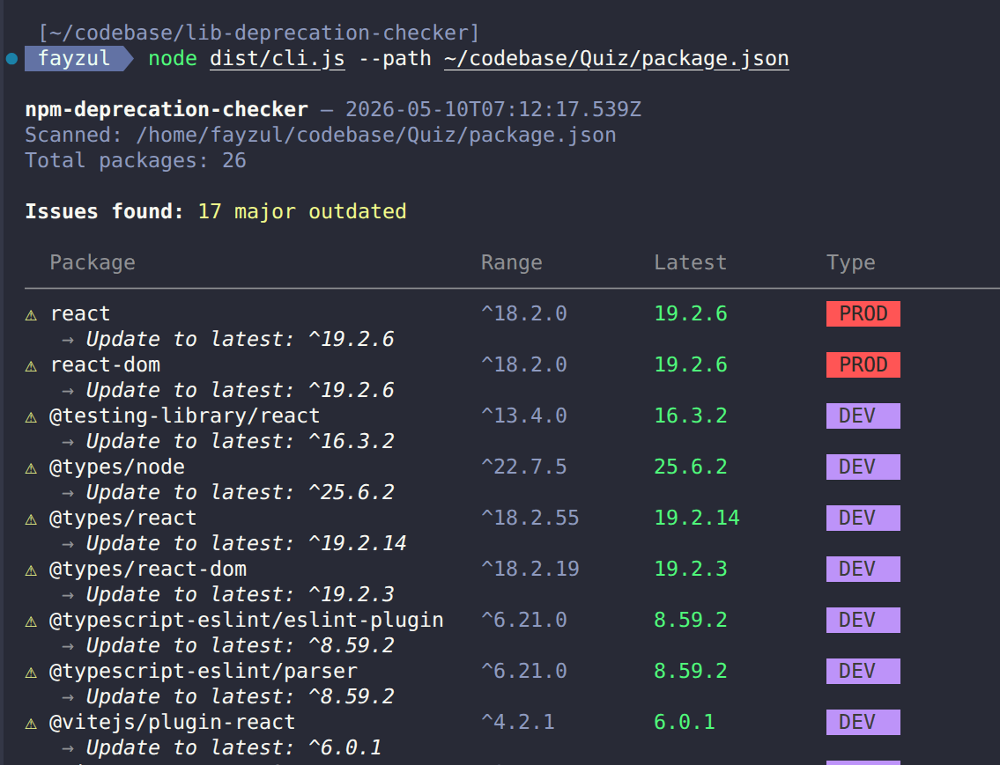

<div align="center">

# npm-deprecation-checker

**Scan your `package.json` for deprecated, outdated, or risky npm packages — before they break your project.**


Works with **npm · pnpm · yarn · bun**

[Quick Start](#-quick-start) · [Usage](#-usage) · [CI Integration](#-ci-integration) · [API Reference](#-api-reference) · [Contributing](#-contributing)

</div>

---

## Overview

Most projects accumulate outdated or deprecated dependencies silently — until something breaks. `npm-deprecation-checker` gives you a clear, actionable report so you can fix issues before they hit production.



---

## Features

- 🔴 **Deprecated detection** — reads deprecation messages directly from the npm registry
- 📦 **Major outdated detection** — flags packages when a newer major version exists
- 🚧 **Pre-release warnings** — detects alpha, beta, or other pre-release version usage
- 🎨 **Readable CLI output** — colored table with icons and dependency type badges
- 📄 **JSON export** — generate machine-readable output for scripts and CI
- ⚡ **Local cache** — file-based cache with 1-hour TTL for faster repeated runs
- 🔁 **CI-friendly exit codes** — easy to enforce in GitHub Actions, GitLab CI, and hooks
- 🧩 **Programmatic API** — use it as a library inside any JavaScript or TypeScript project
- 🔒 **Type-safe registry parsing** — validates npm registry responses with Zod

---

## Installation

```bash
# Run instantly without installing
npx npm-deprecation-checker

# Install globally
npm install -g npm-deprecation-checker

# Install in a project
npm install --save-dev npm-deprecation-checker
pnpm add -D npm-deprecation-checker
yarn add -D npm-deprecation-checker
```

---

## Quick Start

```bash
# Scan the current project
npx npm-deprecation-checker

# Scan a specific package.json
npx npm-deprecation-checker --path ./apps/web/package.json

# Fail CI if issues are found
npx npm-deprecation-checker --strict
```

---

## Usage

### CLI

```bash
# Scan current directory
npm-deprecation-checker

# Scan a specific package.json
npm-deprecation-checker --path ./apps/frontend/package.json

# Strict mode — exit 1 on major outdated too
npm-deprecation-checker --strict

# Export report as JSON
npm-deprecation-checker --json > report.json

# Skip devDependencies
npm-deprecation-checker --no-dev

# Include peer and optional dependencies
npm-deprecation-checker --include-peer --include-optional

# Cache registry responses locally
npm-deprecation-checker --cache ./.ndc-cache

# Disable colored output
npm-deprecation-checker --no-color
```

### Programmatic API

```ts
import { scan, printReport, formatJson } from 'npm-deprecation-checker';

const report = await scan({
  packageJsonPath: './package.json',
  includeDevDependencies: true,
  includeOptionalDependencies: false,
  includePeerDependencies: false,
  strict: false,
  json: false,
  noColor: false,
  concurrency: 10,
  cacheDir: null,
});

printReport(report);

const json = formatJson(report);
console.log(json);
```

---

## Options

| Flag | Description | Default |
|------|-------------|---------|
| `--path <path>` | Path to the `package.json` file to scan | `./package.json` |
| `--no-dev` | Exclude `devDependencies` from the scan | Included |
| `--include-optional` | Include `optionalDependencies` | Excluded |
| `--include-peer` | Include `peerDependencies` | Excluded |
| `--strict` | Exit with code `1` on any issue, including major outdated packages | `false` |
| `--json` | Output the report as JSON | `false` |
| `--no-color` | Disable ANSI colors in terminal output | Color enabled |
| `--concurrency <n>` | Number of parallel registry requests | `10` |
| `--cache <dir>` | Directory used for cached registry responses | None |

### Exit Codes

| Code | Meaning |
|------|---------|
| `0` | No issues found |
| `1` | Issues found |
| `2` | Fatal error, such as invalid file path or invalid JSON |

---

## Output Format

### Human-readable CLI output

```text
npm-deprecation-checker — 2026-05-10T06:53:06.297Z
Scanned: /home/user/my-app/package.json
Total packages: 26

Issues found: 2 deprecated · 15 major outdated
```

### JSON output

```bash
npm-deprecation-checker --json > report.json
```

Example shape:

```json
{
  "scannedAt": "2026-05-10T06:53:06.297Z",
  "packageJsonPath": "/home/user/my-app/package.json",
  "totalScanned": 26,
  "deprecatedCount": 2,
  "majorOutdatedCount": 15,
  "preReleaseCount": 0,
  "errorCount": 0,
  "results": []
}
```

---

## API Reference

### `scan(options)`

Scans a `package.json` file and returns a structured report.

```ts
const report = await scan({
  packageJsonPath: './package.json',
  includeDevDependencies: true,
  includeOptionalDependencies: false,
  includePeerDependencies: false,
  strict: false,
  json: false,
  noColor: false,
  concurrency: 10,
  cacheDir: null,
});
```

### `printReport(report)`

Prints a formatted CLI report to stdout.

```ts
printReport(report);
```

### `formatJson(report)`

Returns the report as a JSON string.

```ts
const json = formatJson(report);
```

### Types

```ts
interface ScanOptions {
  packageJsonPath: string;
  includeDevDependencies: boolean;
  includeOptionalDependencies: boolean;
  includePeerDependencies: boolean;
  strict: boolean;
  json: boolean;
  noColor: boolean;
  concurrency: number;
  cacheDir: string | null;
}

interface ScanReport {
  scannedAt: string;
  packageJsonPath: string;
  totalScanned: number;
  deprecatedCount: number;
  majorOutdatedCount: number;
  preReleaseCount: number;
  errorCount: number;
  results: PackageResult[];
}

interface PackageResult {
  name: string;
  versionRange: string;
  type: 'production' | 'dev' | 'optional' | 'peer';
  latestVersion: string | null;
  isDeprecated: boolean;
  deprecationMessage: string | null;
  isMajorOutdated: boolean;
  isPreRelease: boolean;
  suggestion: string | null;
  error: string | null;
}
```

---

## Package Manager Support

This tool reads `package.json`, so it works across the standard JavaScript package manager ecosystem.

| Package Manager | Supported |
|----------------|-----------|
| npm | ✅ |
| pnpm | ✅ |
| yarn | ✅ |
| bun | ✅ |

---
